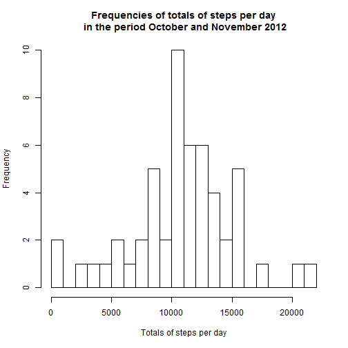
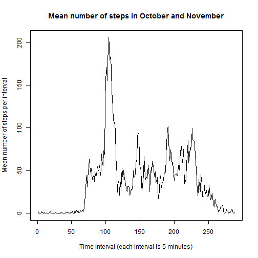
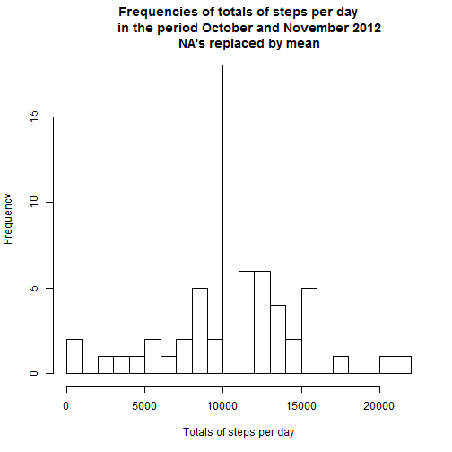
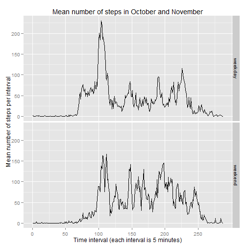

Title:  PA1_template  
Author: Gek Paard  
Date:   Friday, October 10, 2014  


This document describes the exploring of a file from https://d396qusza40orc.cloudfront.net/repdata%2Fdata%2Factivity.zip.  

## Step1  
### Loading and processing the data  
The file is downloaded into the workspace on Friday, October 10, 2014. It is stored in the workspace as a zipped comma-separated csv-file, "activity.zip". The zipfile is included in the Github repository. This file contains data from a personal activity monitoring device. This device collected data at 5 minute intervals through out the day. The data consists of two months of data from an anonymous individual collected during the months of October and November, 2012 and include the number of steps taken 
in 5 minute intervals each day.  
The variables included in this dataset are:  
- steps: Number of steps taking in a 5-minute interval (missing values are coded as NA)  
- date: The date on which the measurement was taken in YYYY-MM-DD format  
-	interval: Identifier for the 5-minute interval in which measurement was taken    

There are a total of 17,568 observations in this dataset.  
The dataset is stored in a comma-separated-value (CSV) file which is zipped. 
After storing the file into a data.frame, the class of the date column is changed to Date and the class of the steps is changed into numeric.

```r
IntFile       <- read.csv(unzip("activity.zip")) 
IntFile$date  <- as.Date(as.character(IntFile$date))
IntFile$steps <- as.numeric(IntFile$steps)
```

## Step 2  
### What is mean total number of steps taken per day?  
In this step two questions should be answered:  
1.  Make a histogram of the total number of steps taken each day  
2.	Calculate and report the mean and median total number of steps taken per day  
*For the first question:*  
The NA's are removed from the data.frame and stored in a seperate data.frame.  
Then the sum of steps per day are calculated.  
A histogram of these calculated steps is made.   
*For the second question*  
Calculate the mean and median of the sum of steps per day  
and show it on the screen. The function "mean" and "median" are used  
because "summary" is less precise.

```r
NoNAFile                 <- na.omit(IntFile)
NoStepsDay               <- aggregate(steps ~ date, data=NoNAFile, sum)
hist(NoStepsDay$steps, breaks = 20, 
     xlab = "Totals of steps per day",
     main = "Frequencies of totals of steps per day\n in the period October and November 2012")
```

 

```r
#
mean(NoStepsDay$steps)
```

```
## [1] 10766
```

```r
median(NoStepsDay$steps)
```

```
## [1] 10765
```
## Step3  
### What is the average daily activity pattern?  
In this step two questions should be answered:   
1.  Make a time series plot of the 5-minute interval (x-axis) and the average number of steps taken, averaged across all days (y-axis)  
2.	Which 5-minute interval, on average across all the days in the dataset, contains the maximum number of steps?  
*For the first question:*   
The mean per interval (over all days) is calculated.  
Then a time series data.frame is made and from that the plot is then made.  
*For the second question*  
The dataframe with means per interval is sorted ascendingly by the means of steps. In the resulting sorted dataframe the first row contains the highest mean.

```r
MeanStepsInterval   <- aggregate(steps ~ interval, data=NoNAFile, mean)
intervalStart       =  1
intervalEnd         =  length(unique(NoNAFile$interval))
SerieInterval       <- ts(MeanStepsInterval$steps,start = intervalStart, 
                          end = intervalEnd, frequency = 1)
plot(SerieInterval, xlab = "Time interval (each interval is 5 minutes)", 
                    ylab = "Mean number of steps per interval", 
                    main = "Mean number of steps in October and November")
```

 

```r
#
SortMean            <- MeanStepsInterval [order(-MeanStepsInterval$steps) , ]
SortMean[1,]
```

```
##     interval steps
## 104      835 206.2
```
  
## Step4  
### Imputing missing values  
In this step four questions should be answered:   
1.  Calculate and report the total number of missing values in the dataset (i.e. the total number of rows with NAs)
2.	Devise a strategy for filling in all of the missing values in the dataset. The strategy does not need to be sophisticated. 
3.	Create a new dataset that is equal to the original dataset but with the missing data filled in.
4.	Make a histogram of the total number of steps taken each day and Calculate and report the mean and median total number of steps taken per day. Do these values differ from the estimates from the first part of the assignment? What is the impact of imputing missing data on the estimates of the total daily number of steps?  
*For the first question:*  
Calculate number of rows with at least one missing value. I checked on missing values on steps alone, and the same number appears. Checking on the other columns gave zero missing values.   Conclusion: only the column steps contains NA's  
*For the second question*  
The NA's will be replaced by the mean of the different intervals.  
*For the third question*  
First the mean of steps is rounded to whole numbers, like all the other steps.  
The replacement is done in a loop. After the replacement a check is done to see if all NA's are gone. This is OK, so the new sums are calculated.  
*For the fourth question*  
A histogram is made from the new data.frame.    
Calculate the mean and median of the sum of steps per day and show it on the screen. The function "mean" and "median" are used because "summary" is less precise. 
  
*Conlusion:*   
The histogram has changed, the high values changed the most, because they had the highest mean. The mean hasn't changed, because the mean replaced the NA's. That can't change the resulting mean. The median lowered because lower values has been introduced in the dataframe.

```r
nrow(subset(IntFile, (is.na(IntFile$steps) 
                      | is.na(IntFile$date) | is.na(IntFile$interval))))
```

```
## [1] 2304
```

```r
nrow(subset(IntFile, (is.na(IntFile$steps))))
```

```
## [1] 2304
```

```r
nrow(subset(IntFile, (is.na(IntFile$date) | is.na(IntFile$interval))))
```

```
## [1] 0
```

```r
#
MeanStepsInterval$steps   <- as.numeric(MeanStepsInterval$steps )
MeanStepsInterval$steps[] <- lapply(MeanStepsInterval$steps,round,0)
IntFile     <- IntFile[order(IntFile$interval),]
fileEnd     =  nrow(IntFile)
nMax        <- nrow(MeanStepsInterval)
n           =  1
m           =  1
x           =  1
border      <- nrow(subset(IntFile, IntFile$interval==5))
y           =  border
for (m in 1:nMax)
{
  for (n in x : y)
  {
    if (is.na(IntFile$steps[n]))
    {
      IntFile$steps[n] <- MeanStepsInterval$steps[m]
    } 
  }
  x = x + border
  y = y + border
  x
  y
}
nrow(IntFile) - nrow(na.omit(IntFile)) 
```

```
## [1] 0
```

```r
#
IntFile$steps <- as.numeric(IntFile$steps)
#
NoStepsDay <- aggregate(steps ~ date, data=IntFile, sum)
hist(NoStepsDay$steps, breaks = 20, 
     xlab = "Totals of steps per day",
     main = "Frequencies of totals of steps per day
      in the period October and November 2012
      NA's replaced by mean")
```

 

```r
#
mean(NoStepsDay$steps)
```

```
## [1] 10766
```

```r
median(NoStepsDay$steps)
```

```
## [1] 10762
```
## Step5   
### Are there differences in activity patterns between weekdays and weekends?  
1.  Create a new factor variable in the dataset with two levels - "weekday" and "weekend" indicating whether a given date is a weekday or weekend day.
2.	Make a panel plot containing a time series plot (i.e. type = "l") of the 5-minute interval (x-axis) and the average number of steps taken, averaged across all weekday days or weekend days (y-axis). The plot should look something like the following, which was creating using simulated data:   
*For the first question:*   
First set the dates to English names.  
Add additional information to the file in the new column sortDay, containing "weekend"" or "weekday".  
Create means for weekday and weekend. Then replace the values in the column interval with rownumbers, per weekday an weekend. This makes a comparison with the plot of step 3 more easy.  
*For the second question:*  
A panel plot with ggplot is made which show the difference in patterns between weekdays and weekend. 

```r
dummy                             <- Sys.setlocale("LC_TIME", "English")
IntFile$sortDay                   <- as.factor(ifelse(weekdays(IntFile$date)
                                      %in% c("Saturday","Sunday"), "weekend", "weekday")) 
MeanStepsInterval                 <- aggregate(steps ~ interval + sortDay, data=IntFile, mean)
MeanStepsIntervalWeekday          <- subset(MeanStepsInterval, 
                                            MeanStepsInterval$sortDay == "weekday")
MeanStepsIntervalWeekday$interval <- c(1:nrow(MeanStepsIntervalWeekday))
MeanStepsIntervalWeekend          <- subset(MeanStepsInterval, 
                                            MeanStepsInterval$sortDay == "weekend")
MeanStepsIntervalWeekend$interval <- c(1:nrow(MeanStepsIntervalWeekend))
MeanStepsInterval                 <- rbind(MeanStepsIntervalWeekday, MeanStepsIntervalWeekend)
#
library (ggplot2)
p0 <- ggplot(MeanStepsInterval, aes(interval, steps)) +
      geom_freqpoly(stat="identity") +
      facet_grid(sortDay~.) +
      labs(title = "Mean number of steps in October and November") +
      labs(x = "Time interval (each interval is 5 minutes)") +
      labs(y = "Mean number of steps per interval") +
      scale_x_continuous(breaks=c(0,50,100,150,200,250))  
p0
```

 

